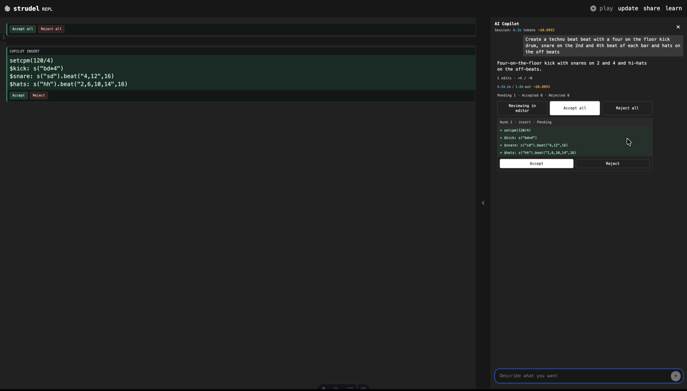

⚠️ DISCLAIMER

This is a **personal educational project** built as part of a **Masterschool Software & AI Engineering graduation project**.

This project is **based on Strudel** (https://strudel.cc), an open-source live-coding music environment originally developed by uzu and contributors.

This repository is **not affiliated with, endorsed by, or intended as an official extension of Strudel**.  
It exists solely for **learning, experimentation, and research purposes**.

---

# Strudel AI Experiment
> A personal learning project exploring AI-assisted live coding — not an official Strudel extension.

**Quick start:** Run the app with `./start.sh` (backend + frontend). Full setup is in [Getting started](#getting-started) below.

An **experimental AI copilot sidebar** for browser-based live coding, exploring how Large Language Models (LLMs) can assist creative coding workflows.

This project investigates how a chat-based AI interface can help with:
- generating Strudel patterns
- modifying existing code
- iterating on musical ideas
- understanding and refactoring live-coding patterns

The AI functionality is intentionally kept **separate from the original Strudel project** and is **not proposed for upstream inclusion**.

---

## See it in action

Screenshot: the REPL with the AI Copilot sidebar. You describe what you want (e.g. “create a techno beat with four-on-the-floor kick…”), the copilot suggests Strudel code, and you accept or reject changes per hunk in the editor or in the sidebar.



Short demo: asking the copilot for a pattern and reviewing the suggested code.

<video src="./strudel-recording.mov" controls width="700"></video>

*In-editor preview may not show the video; [open the video file](./strudel-recording.mov) directly, or view this README on GitHub to see both.*

---

## Project Goals

The goal of this project is to explore:

- AI-assisted creative coding
- Human–AI collaboration in music tools
- Safe, controlled integration of LLMs into real-time systems
- Practical software engineering trade-offs between frontend integration and backend AI services

This work is **educational**, not commercial.

---

## Architecture Overview

The project follows a clean separation of concerns:

### Frontend (Strudel Fork – JavaScript/JSX + some TypeScript)
- Fork of Strudel for **local experimentation only**
- Adds a **right-hand sidebar** with a chat interface
- Reads and updates the Strudel code editor
- Does **not** modify Strudel’s core musical engine

### Backend (Python – FastAPI)
- Hosts the AI “copilot” logic
- Handles:
  - prompt orchestration
  - LLM calls
  - strict output validation (Strudel code only)
  - undo-safe responses
- Can be reused independently of Strudel

This architecture ensures the AI layer is **decoupled**, reversible, and non-intrusive.

---

## What This Project Is NOT

To avoid any confusion, this project is **not**:

- an official Strudel feature
- a proposal for adding AI to Strudel upstream
- a replacement for Strudel
- a commercial product
- a maintained fork intended for general users

It is a **personal learning experiment**.

---

## About the Original Strudel Project

**Strudel** is a browser-based live coding environment inspired by TidalCycles, allowing musicians to create and manipulate musical patterns using code.

- Website: https://strudel.cc
- Try it online: https://strudel.cc
- Documentation: https://strudel.cc/learn
- Technical manual: https://strudel.cc/technical-manual/project-start
- Blog:
  - https://loophole-letters.vercel.app/strudel
  - https://loophole-letters.vercel.app/strudel1year
  - https://strudel.cc/blog/#year-2

Strudel is licensed under the **GNU Affero General Public License v3 (AGPL-3.0)**.

---

## License

This repository inherits the **AGPL-3.0** license from Strudel.
All modifications and experiments remain open-source under the same license.

---

## Getting started

> ⚠️ This setup is for **development and learning only**.

### Prerequisites

- **Node.js** 18+
- **pnpm** (or npm)
- **Python** 3.9+
- **OpenAI API key** (for the copilot)

### One-time setup

From the **project root**:

**1. Backend (Python)**

```bash
python3 -m venv .venv
source .venv/bin/activate   # Windows: .venv\Scripts\activate
pip install -r backend/requirements.txt
```

Create `backend/.env` with your API key:

```
OPENAI_API_KEY=sk-...
```

**2. Frontend (Node)**

```bash
pnpm install
```

**3. Optional – RAG and knowledge base (recommended)**

So the copilot can use the Strudel function reference and validation:

```bash
# With .venv activated, from project root
python -m backend.db.init_db
python -m backend.scripts.import_data
python -m backend.scripts.indexing
```

- `backend.db.init_db` creates the SQLite DB and tables.
- `backend.scripts.import_data` imports functions from `doc.json` (must exist at project root; generate with `pnpm run jsdoc-json`).
- `backend.scripts.indexing` builds the vector store for RAG (requires `OPENAI_API_KEY`).

Details and troubleshooting: [backend/README.md](backend/README.md).

### Run the app

From the project root (macOS/Linux):

```bash
./start.sh
```

- Backend: http://localhost:8000  
- Frontend: http://localhost:4321  
- Press **Ctrl+C** to stop both.

Open **http://localhost:4321** and use the copilot sidebar.

**Without the script (e.g. Windows):**

- **Terminal 1 – backend:** `source .venv/bin/activate` then `python -m uvicorn backend.main:app --reload --port 8000`
- **Terminal 2 – frontend:** `pnpm run start`

### Testing

Backend tests (venv activated, from project root):

```bash
python -m pytest backend/tests -v
```

### Troubleshooting

- **Backend / copilot does nothing** – Backend may have failed (e.g. missing `OPENAI_API_KEY`). Run it in a separate terminal: `source .venv/bin/activate && python -m uvicorn backend.main:app --reload --port 8000`. In the browser, DevTools (F12) → Network: check for failed requests to `http://localhost:8000/api/copilot/chat`.
- **"OPENAI_API_KEY not set"** – Add it to `backend/.env`.
- **Port 8000 or 4321 in use** – Stop the other process or change the port in `start.sh` / uvicorn / Astro.
- **Copilot returns errors** – Ensure the backend is running and the frontend uses `http://localhost:8000`.
- **RAG / "not in the knowledge base"** – Run the optional RAG setup (init_db, import_data, indexing). See [backend/README.md](backend/README.md).
- **Import or indexing fails** – Ensure `doc.json` exists at project root (`pnpm run jsdoc-json`).
